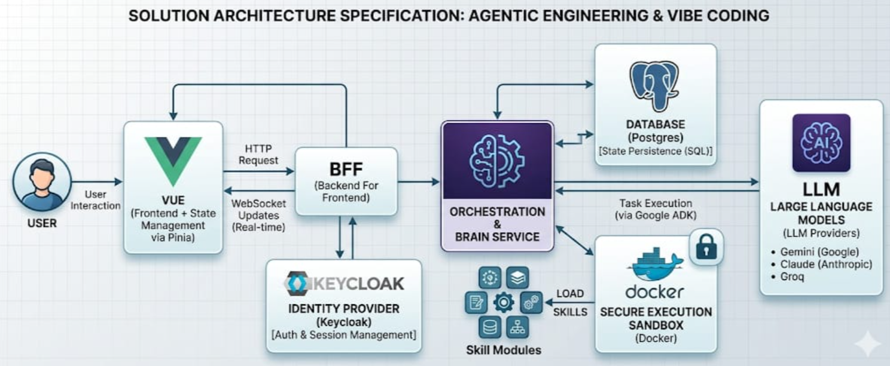

# Purpose

Se definen los principales principios y decisiones de arquitectura para toda la solución 

# Architectural Componentes

## Web

- es una aplicación Vue 3
- se comunica con el BFF
- se integra con Keycloak para autenticación (OAuth2/OIDC)
- autorizacion basada en Feature Flags con 

## BFF

- es una aplicación NodeJS
- se comunica con la API
- permite conexión de Web a través de Websocket para interacciones bidireccionales
- expone endpoints REST seguras (aplicando buenas prácticas entre Front y Backend evitando exponer data sensible en Front Web)

## Sandbox

- Uso de Wasm para sandboxing local (acoplado a la web)
- Uso de Docker para sandboxing en servidor (acoplado a la API)

# MCP

- servidores que exponen herramientas y servicios a los agentes
- se basan en esandard MCP (Model Context Protocol) de Anthropic
- exponen herramientas y servicios a los agentes de forma segura e integrada con Redhat Keycloak.